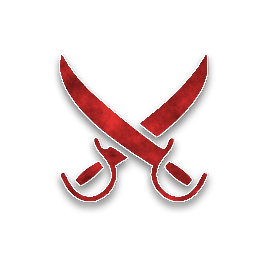

# Polyrhythmic Clocktower

[Blood on the Clocktower](https://wiki.bloodontheclocktower.com) scripts and homebrew creations.

# Custom Scripts

Scripts using standard characters only.

| name | author | notes |
| :--- | :---: | :--- |
| [A Few Good Men](custom/A_Few_Good_Men.json) | capt'n jakub | solo Legion [database](https://botcscripts.com/script/6761) |
| [Death Do Us Part](custom/Death_Do_Us_Part.json) | capt'n jakub | all about death |
| [Delegation of Duties](custom/Delegation_of_Duties.json) | capt'n jakub | [database](https://botcscripts.com/script/6763) |
| [Don't Take My Word For It](custom/Dont_Take_My_Word_For_It.json) | capt'n jakub | hard mode: mechanical confirmation all around [database](https://botcscripts.com/script/6764) |
| [Escort Mission](custom/Escort_Mission.json) | capt'n jakub | Hermit-Lunatic-Recluse-Saint |
| [Miss-a-Line](custom/Miss-a-Line.json) | capt'n jakub | solo Typhon [database](https://botcscripts.com/script/6595) |
| [One and Done](custom/One_and_Done.json) | capt'n jakub | mostly once per game abilities |
| [Stuff Happens](custom/Stuff_Happens.json) | capt'n jakub | Wizard (and Alchemist), Amnesiac, bunch of droisoning [database](https://botcscripts.com/script/6765) |
| [Suspicious Brew](custom/Suspicious_Brew.json) | Puck | solo Kazali |
| [Whose Demon Is It Anyway](custom/Whose_Demon_Is_It_Anyway.json) | Jackson | |

# Homebrew

## Characters

### [Deserter (Outsider)](homebrew/characters/deserter.json)

**When there are 4 players alive, you die. If you are executed, a player might die tonight.**

###  [Partisant (Townsfolk)](homebrew/characters/partisant.json)

**You start knowing 1 in-play Townsfolk. If they die at night, an evil player dies (once). The Demon knows a Partisant is in play.**

Test Script: [Guerrilla Warfare](homebrew/Guerrilla_Warfare.json)

###  [Rampage (Minion)](homebrew/characters/rampage.json)

**On your 1st night, choose 3 players: the 1st time you nominate & execute 1 of them, they all might die tonight.**

Test Script: [On a Roll](homebrew/On_a_Roll.json)

## Scripts

###  [The Dude Abides](homebrew/the_dude_abides/the_dude_abides.json)

* [almanac](https://www.bloodstar.xyz/p/captn_jakub/thedudeabides/almanac.html)
* [database](https://botcscripts.com/script/6594)

# Contributing

New content can be added via pull request into `main`.

A workflow will run to validate all JSON files against the schema. The schema definition should be periodically pulled from `ThePandemoniumInstitute/botc-release` repo, with the `minItems` and `maxItems` attributes removed to allow storing individual characters in their own files. The workflow also validates the schema itself.

## Content Structure

Custom scripts built with standard (TPI) characters only should be placed in the `custom` directory. 

Homebrew (either full scripts or individual characters) should be placed in a dedicated subdirectory of `homebrew`. 

Scripts for play-testing the homebrew characters should be placed in the `homebrew` directory.

List all new content in the appropriate section above, with a local link to the JSON file, and a link to the almanac and/or the script database, if applicable.