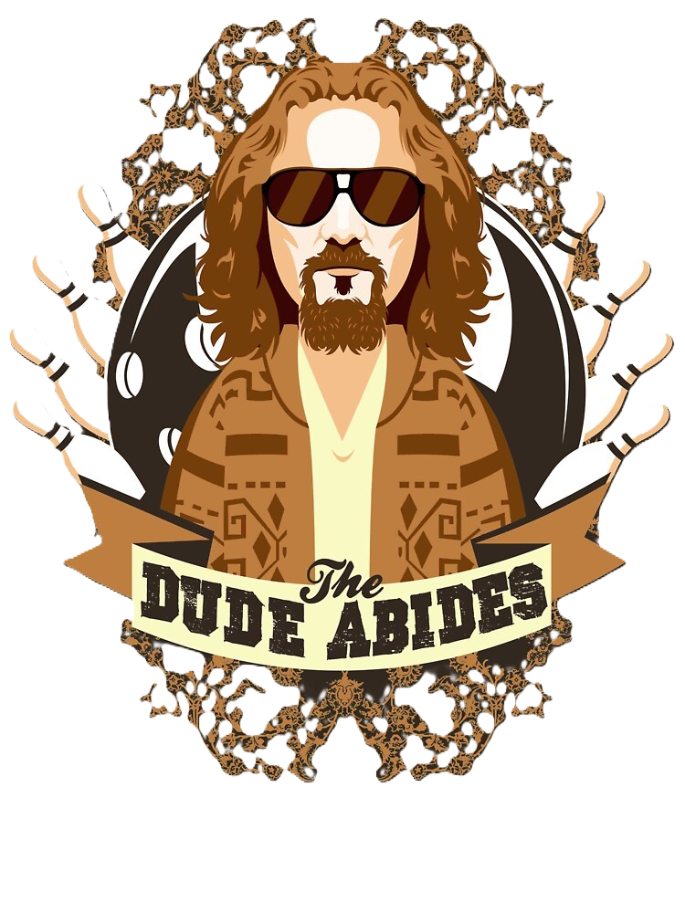

 

_[The Dude Abides v0.9](the_dude_abides.json)_

_[script database](https://botcscripts.com/script/6594)_

# Townsfolk

##  Donny

**You start knowing 1 Townsfolk player.**

> _I am the walrus._

Donny knows a guy. Donny is in his element. Donny might be the walrus.

##  Brandt

**You start knowing 2 not in play evil characters.**

> _We've been frantically trying to reach you, Dude._

Consider the roles in play when giving Brandt their information: if all Minion abilities become apparent early on (e.g. Evil Twin, Vizier, and Psychopath), show the player two not-in-play Demon characters, so the player doesn't feel their ability has no effect on the game.

##  Marty

**You start knowing how many steps from you to the nearest Outsider. [+0 or +1 Outsider]**

> _Dude, uh, tomorrow is already the tenth._

Help the Dude find their [Rug](#-rug), but be careful not to reveal it to [Woo](#-woo), for they'll piss all over it!

##  Sarsaparilla

**Each night, choose a player: they are sober and healthy.**

> _I like your style, Dude._

Sarsaparilla makes 1 player sober and healthy. If the player would become drunk or poisoned while marked Sober, they don't.

If they were already drunk or poisoned when chosen by the Sarsaparilla, turn the relevant reminder token(s) upside down: if the Sarsaparilla selects a different player tomorrow, they may become drunk or poisoned again.

Example: the Sarsaparilla chooses the player who is the Lleech host; the poisoning does not work tomorrow, so the Lleech can be executed and die.

##  Da Fino

**Each night, you learn 2 characters, at least 1 of which woke tonight.**

> _I'm a private snoop! Like you, man!_

Da Fino learns if a player of the given character woke at all, not necessarily due to their own ability. Showing Da Fino a character that doesn't wake at all may point to that player being "mad" today.

Da Fino might learn a not in play character.

##  Stranger

**Each night, choose a player: you learn the character of 1 of their alive neighbours (other than yourself).**

> _Sometimes, there's a man... Lost my train of thought there._

The Stranger learns a character of 1 of 2 players.

The Stranger does not register as a _neighbour_ to their own ability.

##  Maude

**Each night, choose a player (not yourself): they cannot be selected by an evil player. You learn if your previous choice had an effect.**

> _He's a good man, and thorough._

If any evil player targets the Safe player with an ability, show them a 'no' head signal, prompting to choose again.

Each night except the first, show Maude a 'yes' or 'no' head signal to indicate if their ability had an effect since last night, before they make a new choice.

The Safe reminder token remains on the chosen player until Maude chooses again.

##  Little Achiever

**Each night\*, if at least 2 Little Achievers voted today, you learn the character of 1 nominee. [+1 to +3 Little Achievers. 1 of the extras might be evil]**

> _Well, yeah, I did go to collage, but I spent most of my time occupying various administration buildings._

When the Little Achiever votes, place the Voted reminder token on them.

If at least 2 Little Achievers voted today, all alive Little Achievers learn information tonight (votes of dead Little Achiever players also count).

Place the Nominee reminder token on any nominated players that are to be shown to Little Achievers. The information shared with each player might differ, depending on the state of the grim.

##  Dude

**Once per game, at night\*, choose a player: the Rug, if chosen, becomes a Townsfolk. [+the Rug]**

> _New shit has come to light, man._

When the Dude uses their ability, they do not learn if it was successful.

If it was (they selected the Rug), that player becomes a Townsfolk. They might become the Townsfolk they thought they were, in which case they might not learn this, unless they had a 'once per game' ability that they thought they used, and start waking again.

In some cases, the Rug might become a different character, in which case you wake them and inform them of their new character. This might happen when the Rug is already dead, or if the ability they thought they had would no longer be useful to the good team.

##  Walter Sobchak

**Once per game, at night\*, choose an alive player: a Minion, if chosen, dies. All Minions know that Walter Sobchak is in play.**

> _My friend, you're entering a world of pain._

Walter pulls the trigger until it goes "click".

##  Bowling Ball

**When you learn that you died, publicly choose an alive player: if they are evil, all evil players are drunk tonight.**

> _Obviously you're not a golfer._

If the Bowling Ball chose an evil player, all evil players become drunk at dusk. If they forget to make their choice (or choose not to), nothing happens.

##  Bunny Lebowski

**If you are chosen by an evil character's ability, another player might be targeted instead.**

> _Wonderful woman. Very free-spirited. We're all very fond of her._

Bunny confuses the evil team by redirecting madness, poisoning, or night kills.

This might result in the Demon killing an Outsider instead, or the Poisoner poisoning the other Minion. With the right attitude, you might even redirect a Psychopath kill!

  
##  Caucasian

**If the Demon kills you, you learn 2 alive characters, 1 good and 1 evil.**

> _Fuck, man!  There's a beverage here!_

The later in the game the Caucasian dies, the stronger their information becomes.

The Caucasian's ability triggers upon death - if the player is drunk or poisoned when they die, they might learn incorrect information.

# Outsiders

##  Rug

**You think you are a Townsfolk character, but you are not.**

> _It really tied the room together._

The Rug functions exactly like the Drunk: if the character they think they are would wake to act at night, they wake to act, etc.

  
##  Johnson

**When you die, a player might die tonight.**

> _Tomorrow vee come back und cut off your chonson._

Does what it says on the tin.

##  Smokey

**If you die during the day, all but 1 Townsfolk are drunk until dawn.**

> _Gimme the marker, Dude, I'm marking it an eight._

Smokey should strive to die at night. 

If Smokey is executed and dies, one Townsfolk remains sober; this way, evil team can still bluff Smokey, even with Townsfolk who can prove themselves mechanically (e.g. Professor, or Banshee).

##  Fawn Gunderson

**If you are \"mad\" about being an Outsider, a player might turn evil.**

> _How ya gonna keep 'em down on the farm once they seen Karl Hungus?_

Fawn Gunderson has the potential to slowly turn the entire town around them evil.

# Minions

##  Jesus

**Each night, choose a player: they are poisoned. If you chose a new player, they learn this. Players \"mad\" that the Jesus is in play might die.**

> _You said it, man._

The players chosen by the Jesus know that they're poisoned, but cannot share this information with other players.

If the Jesus chooses the same player as the previous night, don't wake the target - the players should only learn when they become poisoned.

##  Logjammer

**Each night\*, choose a player (different to last night): they don't wake due to their own ability tonight.**

> _Za, okay, I bring mein toolz._

The Jammed player does not wake, but they do not learn why. Make sure the players know this can happen.

The presence of the Logjammer on the script also means that their presence in game can be immitated by not waking drunk or poisoned players.

Note the interaction with the [Little Achiever](#-little-achiever), who have other reasons for not waking in the night (either only 1 alive, or 1 or more did not vote).

##  Larry Sellers

**You register as the Demon to good characters' abilities, & the Demon doesn't.**

> _The most important purchase in history is the Louisiana Purchase. It was also the most important evente. It was when the United States bought lande from the French guys. The Louisiana Purchase was very. There was alot of land._

Protection for the Demon and distraction to town: Larry seems to be an important character in the story, until you actually meet the guy.

The Demon can register as any character type other than Demon. Larry Sellers can register as the in play Demon character, or others.

##  Woo

**If the Demon chose an Outsider tonight, choose a player: they are poisoned until you choose again, even if you are dead. [+1 or +2 Outsiders]**

> _We know which Lebowski you are, Lebowski. Jackie Treehorn wants to talk to the deadbeat Lebowski._

Additional source of poisoning is a bonus - the main ability of Woo is reducing the size of town.

If they do get to act, however, their posioning remains in effect indefinitely, as long as Woo remains sober and healthy (note that droisoning the dead Woo would temporarily disable their poisoning).

Players poisoned by Woo who die when [Jackie Treehorn](#-jackie-treehorn) is in play become healthy as they normally would.

# Demons

##  Big Lebowski

**Each night, choose 2 players. If both players chosen last night voted today, 1 of them dies; otherwise, they both die.**

> _Are you employed, sir?_

During the day, if both Hired players voted, place the Delivered reminder token on the Big Lebowski.

During the night, if the Delivered token is placed, only one of the Hired players dies (you choose which), otherwise, they both die. Big Lebowski prefers for the Hired players not to do their job properly.

##  Jackie Treehorn

**Each night, choose a player: they are poisoned. If no players died today, they die. When a poisoned player dies, they become healthy, and their alive good neighbour dies tonight.**

> _What's your drink, Dude?_

Jackie Treehorn poisons players each night. They remain poisoned until they die.

If the player dying to Jackie Treehorn is also poisoned, it triggers a chain reaction until a healthy player dies.

When Jackie Treehorn is in play, its ability triggers when a player poisoned in any way dies - not only poisoned by Jackie Treehorn.

##  Nihilist

**Each night\*, choose a player (even if you are dead): they might die. You register as a Minion too. [All evil players are Nihilists]**

> _Vee belief in nossing. Give us ze money, Lebowski!_

During the first night, during the Demon Info step, let all Nihilists make eye contact.

Each night except the first, Nihilists wake separately, even if dead. Any player chosen by at least one Nihilist might die.

If a player is chosen by more than one Nihilist, they should always die, to reward the evil team's coordination. In most situations, the Nihilists should not kill more than 3 players in one night.

The choices made by alive Nihilists should have more weight than the dead ones'. The objective of the dead Nihilists is to provide support to the choices of their alive buddies.

##  Eagles

**Each night\*, choose a player: they die. 1 alive good player who said \"I hate the fucking Eagles\" when nominated today is poisoned. If there is no such player, choose another: they die.**

> _That's it! Outta this fucking cab!_

During the day, when a good player says "I hate the fucking Eagles" when nominated, mark them as Poisoned. If more good players say it, you choose which one is Poisoned.

Exactly 1 good alive player may be poisoned by the Eagles. If the Poisoned player dies, they immediately become sober, and another living good player who said the phrase today becomes Poisoned, if possible.

In the night, if no good player is Poisoned by the Eagles, they choose 2 players; otherwise, they choose 1.

# Scrapped Characters

##  Chief (Minion)

**Each night, choose a player and an Outsider character: they are \"mad\" about being that Outsider tomorrow, or may become that Outsider at dusk.**

> _Stay out of Malibu, deadbeat! Keep your ugly fucking goldbricking ass out of my beach community!_
